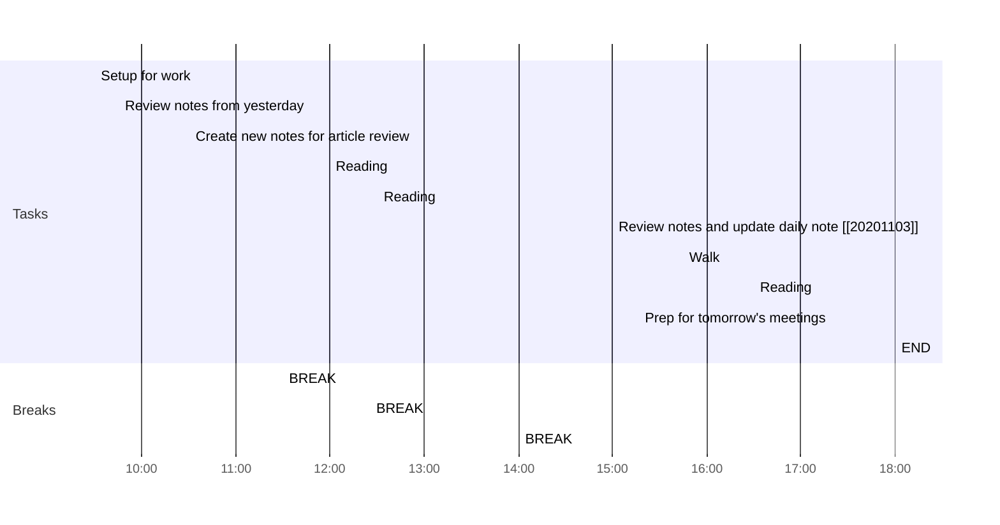

## Day Planner

This is my plan for the day broken into 3 main sections:
1. Morning Prep
2. Reading
3. Afternoon Review

### Morning Prep

This is where I get ready for work and do my usual prep.

- [x] 09:30 Setup for work
- [x] 09:45 Review notes from yesterday
- [ ] 10:30 Create new notes for article review
- [ ] 11:30 BREAK

### Reading

A section of the day dedicated to reading:

1. Articles.
2. Book chapters assigned for the day.
3. Re-reading past notes.
   
- [ ] 12:00 Reading
  - [ ] Article 1
  - [ ] Article 2
  - [ ] Article notes review
- [ ] 12:25 BREAK
- [ ] 12:30 Reading
- [ ] 14:00 BREAK

### Afternoon Review

I use this time to review what I have done earlier in the day and complete any tasks to prepare for the next day.

- [ ] 15:00 Review notes and update daily note [[20201103]]
- [ ] 15:45 Walk
- [ ] 16:30 Reading
- [ ] 17:20 Prep for tomorrow's meetings
- [ ] 18:00 END
---

