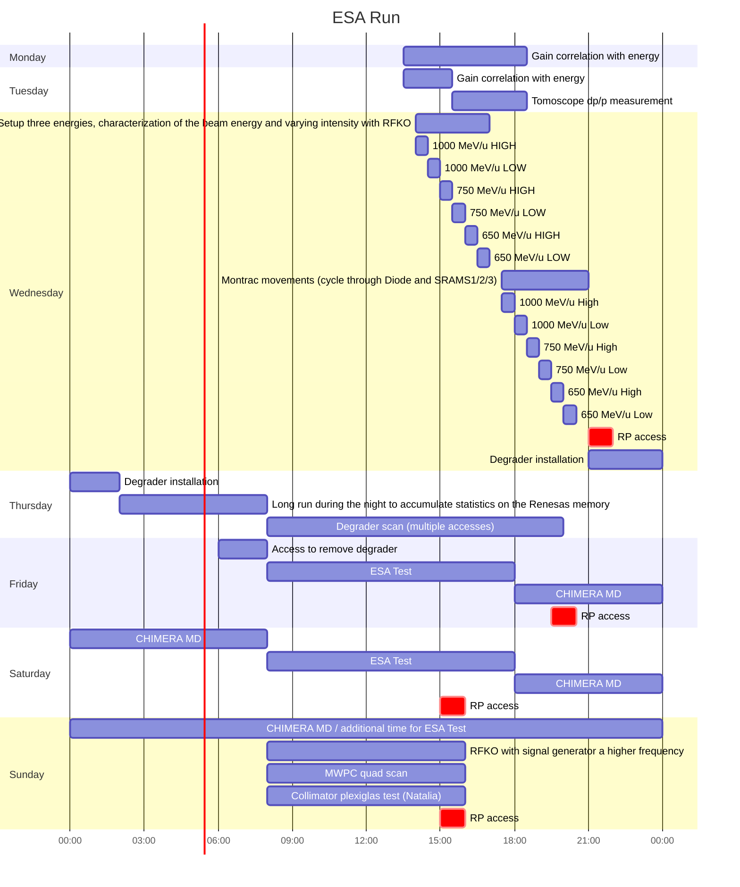

[Editor link](https://mermaid-js.github.io/mermaid-live-editor/edit#pako:eNqtVdtq20AQ_ZVBUEjAqSXLkmW9haSpS6u22KGB4petNJaWWrvuXto4If_ekVaRbw2lUD8IMzPnzO3s7qOXywK91CuZMGYpgH6GmzXCm8UlzK1wpoIZvJGqZgZgNruoa2dm91x35lez9FXW4WXBthlT31GBXK2WHYfG3HApIJOC_M_Wt4wLyKVSuGat-xc3FaBAVW5TCMKL0B9AVB2T3FrU_8oyqlzwraylzuUGodgMN1Aj01ZhjcJQaNSGhm3Cw5R3WIguaWNeoLEbMJVCdIk46gHkFVMsN6j4gytErigG4RuyuqsHmCjgJ1NbLkrgwqDQ3GxdxfOb95-oiPGF3xXRZAp834cMvwwtzN69nUH67Pfrk4APn-5af7jvn0RH-OgQv_M7eHQIj4_gEMSH-PgQ3_h7AhdBOzc0F6jlz3bQGs7ybU4qo_lJW1ZwzUmG7WQW88tsEQxHw_CcmCZuc8GOan8avKz6mD9OQ_4if7Kr9mQejiF5aV6OYHpMEB8TTF-aWEsw8g_n5b7zz8DyHLVOIVfcNF22YUEv9mssFSvoFHGhDVt30k6fA8PTU1FZtVPoH-Ep-K6aUY_-IEmIygoorGo02ehVUF-GTnJToq0tYRGIxHBteK6BcjVRc1K0ZpqOUC0VHTR_1FLHpx3onAk4IyLDN7R21zhqWrHv1hOMTrq5Ubzv5bIFNAXRSSURQdExE0Hc99NENvfWLWqzY_Y7z9XsXfZmfgnZdS-KXaUn2-h2GpyUtWDGqr6wfdJussn_riQ60kVfid2_SXekMARWFLyJYWu6zmuElVT79XQSGO-S0sXjriDNywZVNpcVMwRjUJEYaIcrhT8sinzbN_TcaXb3-Qp-WFa0ez5xX8n1mtctGS3_npdr0oyhSuDsIyNlcnZ-gHGovwxiKbyBVyM9Pryg9-uxAS09UmWNSy-lvwW9QEtvKZ4ojlkjF1uRe-mKrTUOPLtpnrRrzkhFdW_dMOGlj969l16Mg8nrMJlEiR-M42AcJOHA25I9ImsQh3EcJ-PpOJlMoqeB9yAlkQSvR9PxlJzTIJyM4sSfDDykNUiVuTe2fWrbLF9bgFEWn34DawozHg)

