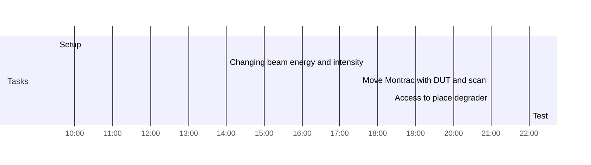

## Plan for 5-day ion run

Concerning the 5-day CHIMERA ion run, we need to start getting specific about the related test plan. My proposal for the first ~12h would be the following. We can use this email thread (and, of course, this week’s CHIMERA meeting) to continue discussing about it and extend the schedule further.

In terms of beam conditions, the baseline should be to run with 3 different PS energies (1 GeV/n, 750 MeV/n and 650 MeV/n) and varying intensity, through the RFKO technique. In principle other parameters such as the beam spatial profile and spill time profile will not be (intentionally) altered. Therefore, the main elements we will be changing, in addition to the energy and the intensity, will be the degrader and devices under test.

The first few hours of the beam time (e.g. 2 to 5:30 PM – all times are very tentative, of course) should be devoted to characterizing the three energies and varying intensity, as per the “standard”  beam instruments, making sure they are logging adequately, are set to the correct values (e.g. gain, voltage, etc.). This could in principle be done without the DUTs (diode and three SRAMs) in place, to spare them from some fluence during the setup, and to really focus our efforts on the beam instruments.

Then (5:30 – 9 PM), we could move in the Montrac with the DUTs, hoping this operation does not require an access, now that there will be no other users (i.e. racks, extra cable chains) in CHARM. And, we would test all four of them sequentially, for all energies, and perhaps 2 or 3 intensities each. Each irradiation will be short, but of course, 3 energies x 2 intensities x 4 DUTs is already = to 24 runs.

Then (9 PM – 2 AM), we would hopefully be able to access and place a degrader thickness which would ideally give us 3 new energies, one per each PS energy. We would therefore repeat all measurements already introduced above.

After that, we could perhaps leave a longer run over night, to e.g. accumulate statistics on the Renesas memory.

And, that would basically bring us to the access of Thursday morning, during which we could either change to a second degrader thickness, or to another set of DUTs. Or, something also potentially interesting could be to do a “degrader scan”, i.e. progressively adding thickness up to the point we reach the range of the beam and fully stop the primary ions, which would hence also be an indirect measurement of the beam energy.  

What do you think about this initial proposal?

After that, Friday would of course be fully devoted to the ESA tests, and possibly at least a part of Saturday as well, in case they need to collect more data. But, depending on whether ESA are interested in long runs, we could still have the night for “ourselves”. And, this would anyway leave us at least Saturday night and Sunday as backup (e.g. for extra tests) and for the optics measurements by Eliott, of course.

Looking forward to your feedback and extra ideas!!

### Wednesday 23

* Set up the three energies
	* 1 GeV/n
	* 750 MeV/n
	* 650 MeV/n
* Vary the intensity (RFKO)

* Changing elements:
	* Energy
	* Intensity
	* Degrader
	* Device under test

* Not changing:
	* Beam size = not altered
	* Spill length = not altered

14:00 - 17:30:
* Characterization of the beam energy and varying intensity
* Make sure instruments are logging
* Set the gain to correct values
	* XSEC (gain = HIGH)
	* MWPC (voltage)
* DUT:
	* Empty (no diode, no 3 SRAMS to spare fluence)

17:30 - 21:00:
* Move the MONTRAC with DUT:
	* Diode
	* 3 SRAMs
* Test all 4 equipment sequentially
	* For all 3 energy
	* 2-3 intensities
	* 3 energies x 2 intensities x 4 DUTs is already = to 24 runs

* 21:00 - 02:00:
	* Access to place a degrader of specific thickness:
		* This will create three new energies
	* Repeat all measurements

### Thursday 24

02:00 - 08:00:
* Long run during the night to accumulate statistics on the Renesas memory

Acess
08:00:
* Change degrader thickness
* Another set of DUT
* Degrader scan:
	* Progressively adding thickness up to the point where we fully stop the primary ions (= measurement of beam energy)

### Friday 25

* ESA Test
* Nights:
  * Available for our own measurements

### Saturday 26

* ESA Test
* Nights:
  * Available for our own measurements

### Sunday 27

## Day Planner

### Morning

- [ ] 09:30 Setup
- [ ] 14:00 Changing beam energy and intensity
- [ ] 17:30 Move Montrac with DUT and scan
- [ ] 21:00 Access to place degrader
- [ ] 22:00 Test

### Test
- [ ] test
- [ ] 